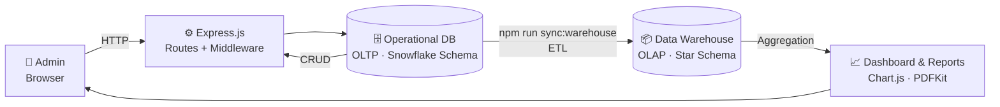
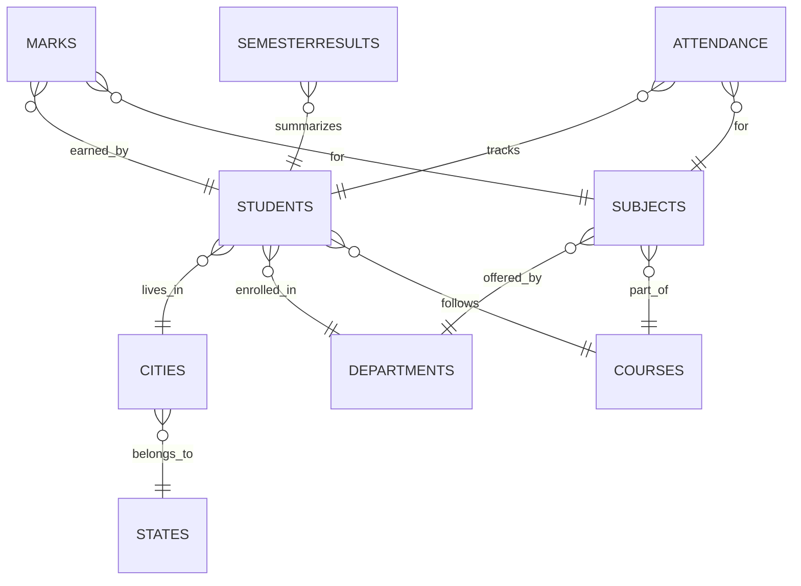
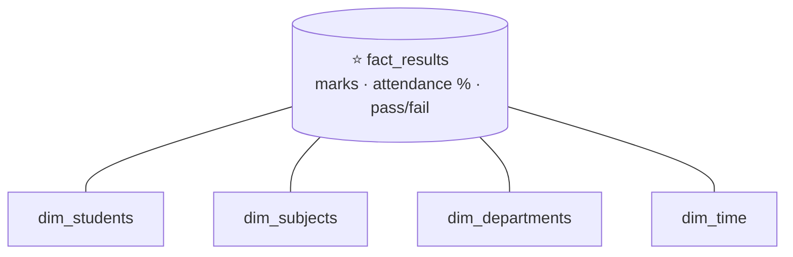

<div align="center">

# 🎓 GradeX

### Student Result Analysis System with an OLTP + OLAP Data Warehouse

*A full-stack admin dashboard for managing students, marks, attendance, and results, backed by a Snowflake-schema operational DB and a Star-schema warehouse.*

<br>


<br>

[✨ Features](#-features) •
[🏗️ Architecture](#️-architecture) •
[🗄️ Data Layer](#️-the-data-layer) •
[🚀 Getting Started](#-getting-started) •
[🧪 Demo Flow](#-suggested-demo-flow)

</div>

---

## 📖 Overview

**GradeX** is a beginner-friendly, full-stack mini project built to demonstrate **Advanced DBMS concepts** in a real application. An admin can manage students, subjects, marks, attendance, and semester results from a modern dashboard, while analytics are powered by a separate **data warehouse** so reporting never slows down day-to-day operations.

> 💡 **Core idea:** transactional data lives in a normalized **Snowflake schema (OLTP)**, and an **ETL script** reshapes it into a **Star schema (OLAP)** for fast analytics.

---

## 📸 Screenshots


| Dashboard | Marks Management |
| :---: | :---: |
|  |  |

| Reports & Warehouse Sync | Printable Marksheet |
| :---: | :---: |
|  |  |

---

## ✨ Features

| | Feature | Description |
| :-: | --- | --- |
| 🔐 | **Admin Login** | Session-based authentication with protected routes |
| 📊 | **Analytics Dashboard** | Summary cards and interactive Chart.js charts |
| 👩‍🎓 | **Student CRUD** | Add, edit, delete, search, and paginate students |
| 📚 | **Subject CRUD** | Manage subjects with search and pagination |
| 📝 | **Marks Management** | Auto-calculated total, grade, and pass/fail status |
| 🗓️ | **Attendance Tracking** | Auto-calculated attendance percentage |
| 🏆 | **Semester Results** | Per-student, per-semester performance summary |
| 📄 | **Reports** | PDF export, warehouse sync, and schema explanation |
| 🌙 | **Dark Mode** | One-click theme toggle |
| 🖨️ | **Printable Marksheet** | Clean, print-ready student marksheet |
| 🌱 | **Seed Data** | One command to load realistic dummy data |

---

## 🏗️ Architecture



---

## 🗄️ The Data Layer

GradeX uses MongoDB with Mongoose, organized into **two distinct systems**:

### 1️⃣ Operational Database (OLTP) — Snowflake Schema

Handles real-time transactions. Related details are normalized into separate collections to avoid redundancy.



| Collection | Purpose |
| --- | --- |
| `admins` | Administrator credentials |
| `students` | Core student details, references `cities`, `states`, `departments`, `courses` |
| `subjects` | Subject info, references parent `department` and `course` |
| `marks` | Student marks; **pre-validation hooks** auto-calculate total, grade, pass/fail |
| `attendance` | Total and present classes with auto-calculated percentage |
| `semesterresults` | Overall semester performance per student |
| `cities` · `states` · `departments` · `courses` | Normalized reference collections |

### 2️⃣ Data Warehouse (OLAP) — Star Schema

A secondary warehouse powers analytics without loading the operational database.



- **Fact collection:** `fact_results` stores the measurable events (marks, attendance percentage, pass/fail).
- **Dimension collections:** `dim_students`, `dim_subjects`, `dim_departments`, `dim_time` hold flattened descriptive attributes.

### 🔄 ETL Process

```bash
npm run sync:warehouse
```

**Extract** from operational collections → **Transform** into star-schema format → **Load** into `fact_results` and the dimension collections.

---

## 🧮 Grading & Validation

<table>
<tr>
<td valign="top" width="50%">

### 🏅 Grade Rules

| Score | Grade |
| :-: | :-: |
| 90+ | **A+** |
| 80+ | **A** |
| 70+ | **B** |
| 60+ | **C** |
| 40+ | **D** |
| < 40 | **Fail** |

> **Total Marks** = average of *Internal* and *External* marks, keeping the result on a 0–100 scale.

</td>
<td valign="top" width="50%">

### ✅ Validation Rules

- Required fields cannot be empty
- Email must be valid
- Phone must contain only numbers
- Marks must be between 0 and 100
- Present classes ≤ total classes
- No duplicate roll numbers
- No duplicate student–subject marks or attendance
- No duplicate student–semester results

</td>
</tr>
</table>

---

## 🚀 Getting Started

### Prerequisites

- [Node.js](https://nodejs.org/) (v16+ recommended)
- [MongoDB](https://www.mongodb.com/try/download/community) running locally

### Installation

```bash
# 1. Clone the repository
git clone https://github.com/sk200005/GradeX.git
cd GradeX

# 2. Install dependencies
npm install

# 3. Configure environment
cp .env.example .env

# 4. Load sample data
npm run seed

# 5. Start the app
npm start
```

Then open **http://localhost:3000** 🎉

### ⚙️ Environment Variables

```env
PORT=3000
MONGODB_URI=mongodb://127.0.0.1:27017/student_result_analysis_system
SESSION_SECRET=student_result_secret_key
```

> ⚠️ Change `SESSION_SECRET` and the default admin password before deploying anywhere public.

### 🔑 Default Login

| Username | Password |
| :-: | :-: |
| `admin` | `admin123` |

### 📜 Available Commands

| Command | What it does |
| --- | --- |
| `npm install` | Install dependencies |
| `npm run seed` | Insert demo data |
| `npm run sync:warehouse` | Rebuild the data warehouse (ETL) |
| `npm start` | Start the server |

---

## 🗺️ Main Routes

| Route | Page |
| --- | --- |
| `/login` | 🔐 Admin login |
| `/dashboard` | 📊 Analytics overview |
| `/students` | 👩‍🎓 Student management |
| `/subjects` | 📚 Subject management |
| `/marks` | 📝 Marks management |
| `/attendance` | 🗓️ Attendance management |
| `/results` | 🏆 Semester results |
| `/reports` | 📄 Reports, PDF export, warehouse sync |

---

## 📁 Project Structure

```text
GradeX/
├── 📂 middleware/     # Authentication middleware
├── 📂 models/         # Mongoose schemas (OLTP + warehouse)
├── 📂 routes/         # Express route handlers
├── 📂 views/          # EJS templates
├── 📂 public/         # CSS, client-side JS, images
├── 📂 scripts/        # seed.js, syncWarehouse.js
├── 📂 utils/          # Shared helpers
├── 📄 app.js          # Application entry point
├── 📄 .env.example    # Sample environment config
└── 📄 package.json
```

---

## 🌱 Sample Data Included

The seed script creates:

| 🏫 Departments | 📘 Courses | 🌍 States & Cities | 👩‍🎓 Students | 📚 Subjects |
| :-: | :-: | :-: | :-: | :-: |
| ✔️ | ✔️ | ✔️ | **12** | **6** |

…plus marks, attendance, semester results, and warehouse dimension and fact data.

---

## ⚙️ How It Works

- 🔐 **Auth:** Express sessions with custom authentication middleware protecting pages
- 🪝 **Auto-calculation:** Mongoose pre-validation hooks compute marks totals, grades, and attendance percentage
- 📈 **Charts:** Chart.js renders dashboard visuals in the browser
- 🧮 **Reports:** MongoDB aggregation pipelines over the warehouse
- 📄 **PDF export:** Generated server-side with `pdfkit`

---

## 🧪 Suggested Demo Flow

1. 🌱 Seed the database with `npm run seed`
2. 🔐 Log in as `admin / admin123`
3. 📊 Explore the dashboard charts
4. 👩‍🎓 Add or edit a student
5. 📝 Manage marks and attendance
6. 🏆 Add a semester result
7. 🔄 Open **Reports** and sync the warehouse
8. 🖨️ Print a marksheet

---

## 🛣️ Roadmap

- [ ] Role-based access (teacher / student views)
- [ ] CSV import for bulk student and marks upload
- [ ] Scheduled automatic warehouse sync
- [ ] Docker setup for one-command startup

---

## 🤝 Contributing

Contributions, issues, and feature requests are welcome! Feel free to open an [issue](https://github.com/sk200005/GradeX/issues) or submit a pull request.

---

<div align="center">

**Built with ❤️ by [@sk200005](https://github.com/sk200005)**

⭐ If you found this project useful, consider giving it a star!

</div>
